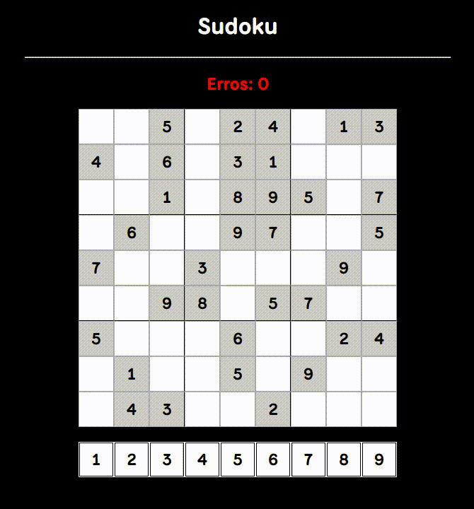

# Sudoku

Um projeto simples de jogo Sudoku.

## 📷 Preview



## 📄 Sobre

Este projeto implementa um jogo de Sudoku onde o usuário pode:

- Escolher números de uma paleta.
- Preencher o tabuleiro.
- Receber contagem de erros ao inserir números incorretos.

O objetivo é completar o tabuleiro com o menor número de erros possível.

## 🎯 Funcionalidades

- Geração de tabuleiro inicial com números pré-definidos.
- Sistema de seleção de números.
- Validação automática dos números inseridos.
- Contador de erros visível.

## 🛠️ Tecnologias utilizadas

- HTML5
- CSS3
- JavaScript (puro)
- Fonte: [National Park - Google Fonts](https://fonts.google.com/specimen/National+Park)

## 💡 Como usar

Entre no site: [Sudoku](https://sudoku-efrals.netlify.app)

OU

1. Clone este repositório:

   ```bash
   git clone https://github.com/Efrals/sudoku.git
   ```

2. Navegue até a pasta do projeto

3. Abra o arquivo `index.html` em seu navegador.
